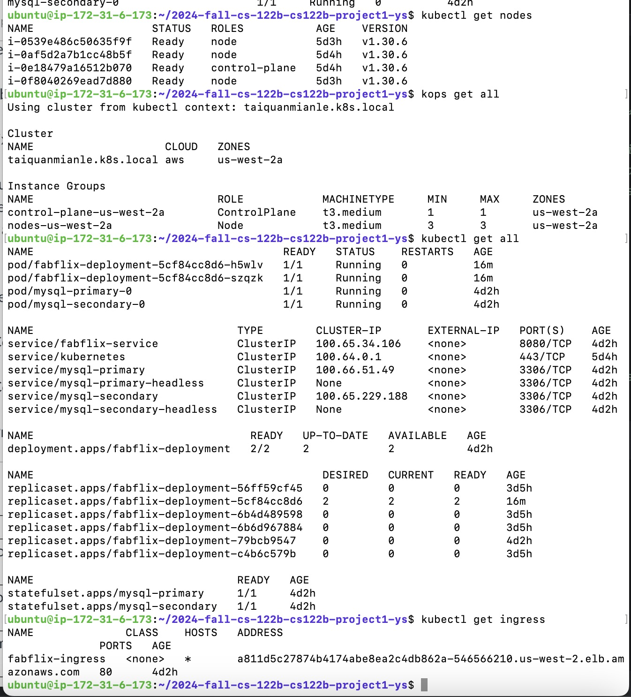
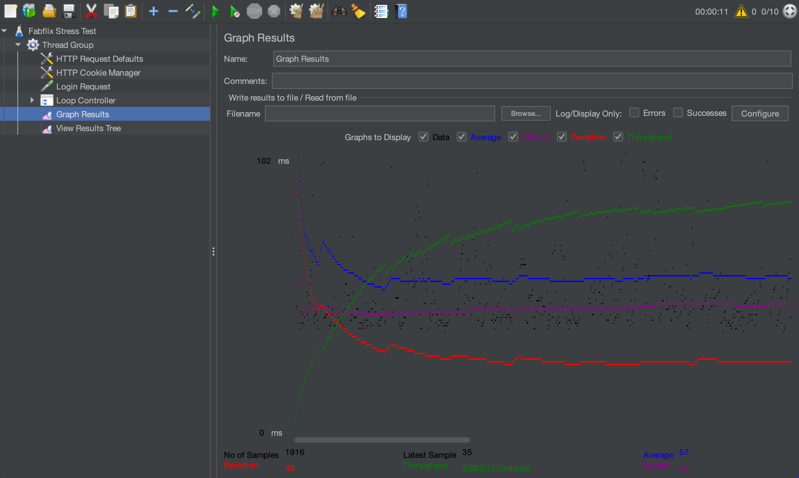
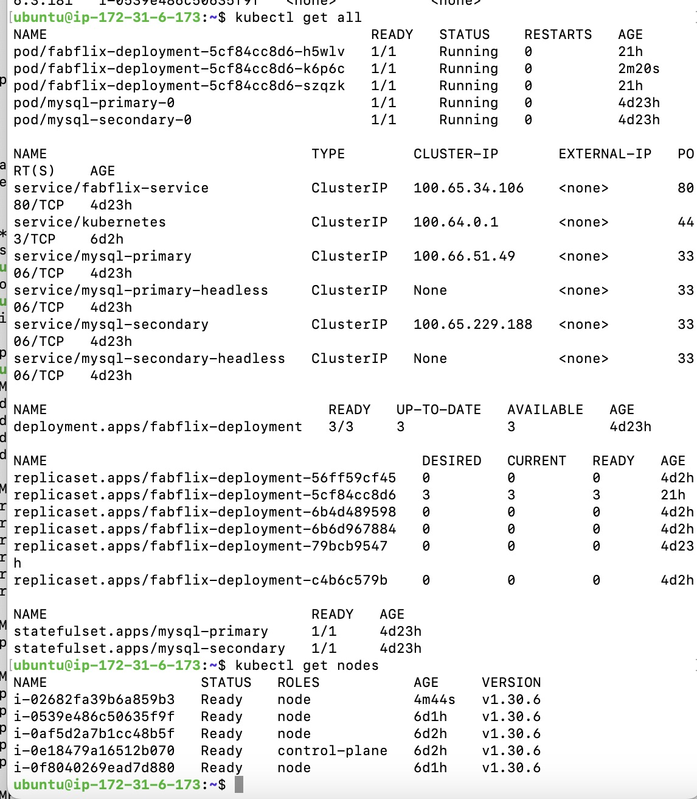
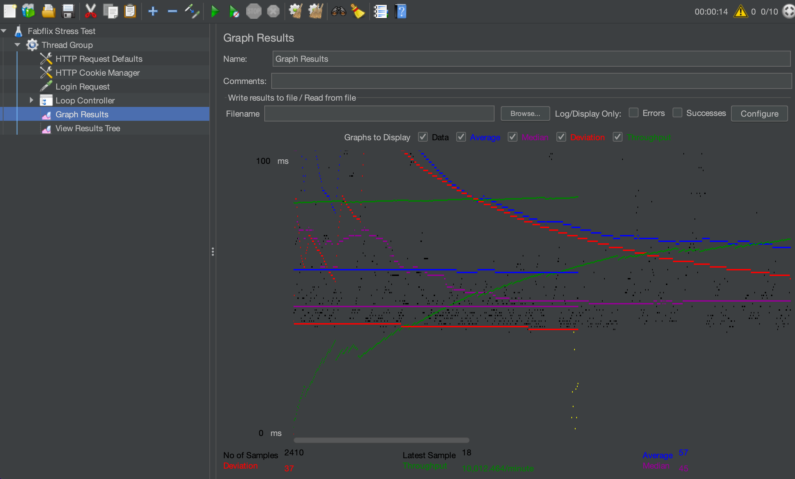

# Fablix Application - Project 5: Fabflix Advanced Features

## Project Overview
Fabflix is a full-featured web application enabling users to browse, search, shop, and manage movie information. In Project 5, we focused on implementing advanced features and deploying the application to a Kubernetes (K8s) cluster for enhanced performance, scalability, and reliability.
Key features include:
- JDBC Connection Pooling for optimized query handling.
- Kubernetes Deployment with scalability, load balancing and Master-Slave Database Replication.
- Performance Testing using Apache JMeter.

## Instruction of deployment
This application is deployed on an AWS EC2 instance, which is configured with the necessary software to support the application, including:
- Kubernetes Tools: Kops, kubectl.
- Application Components: Java 11, Tomcat 10, MySQL 8.0.
- Docker: Build and push Fabflix Docker images.
- JMeter: Test performance.

Deployment Steps:
- Access the EC2 instance(k8s-admin) via ssh.
- Prepared the instance, the existing database and Git repository are cleared, and the movie-data.sql and create_table.sql files are stored for later use.
- Restart the instance to ensure a clean state.
- SSH into the EC2 instance again and perform a fresh Git clone of this project.
- Use the prepared SQL files to create and populate the MySQL database.
- Deploy the application using docker image.
- Once the deployment is complete, the application is accessible via the EC2 instance’s public IP.

## Performance Testing with JMeter
Objectives: Stress test the Fabflix search feature using 10 threads.
Measure throughput under:
- 2 Fabflix pods and 3 worker nodes.
- 3 Fabflix pods and 4 worker nodes.

Test Plan:
- Use query_load.txt as input for search titles.
- Create a JMeter test plan (fabflix.jmx):
- Login and send search requests.
- Iterate through query_load.txt in an infinite loop.
- Run test
- Collect Results

## Result of Performance Testing
- # JMeter TS/TJ Time Measurement Report
| **3 nodes  Test Plan** | **Graph Results Screenshot**            | **Graph Results Screenshot**             | **Throughout**  | **Average** |
|------------------------|-----------------------------------------|------------------------------------------|-----------------|-------------|
| Case 1: HTTP/10 thread |  |   | 9923.177/minute | 57          |

| **4 nodes Test Plan**  | **Graph Results Screenshot**            | **Graph Results Screenshot**            | **Throughout**    | **Average** |
|------------------------|-----------------------------------------|-----------------------------------------|-------------------|-------------|
| Case 1: HTTP/10 thread |  |  | 10012.464/min     | 57          |

## Demo Video
A demo video showcasing the setup and features can be found here: https://www.youtube.com/watch?v=Ot35snQ_FZg

## Project Structure
This project is designed with a clear separation of frontend and backend functionality.
Key Configuration Files:
- Dockerfile: Defines the Docker image for the application.
- fabflix-deployment-service.yaml: Kubernetes deployment configuration.
- ingress.yaml: Ingress setup for load balancing.
- fabflix.jmx: Jmeter test file.

## Team Contributions
We collaborated on demo recording and Jmeter testing.
Our specific contributions were as follows:
- Xuan Gu: wrote the README file, implemented K8s cluster functionalities.
- Qizhi Tian: implemented Docker functionalities, finalized the Fabflix application.